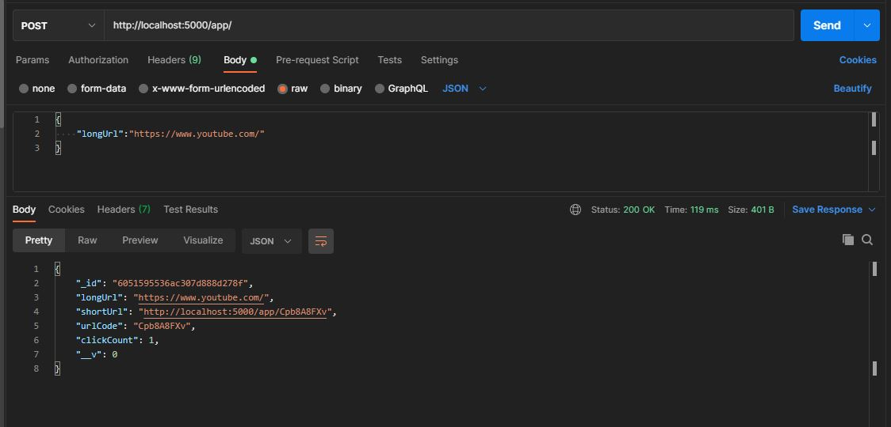

# API acortador de enlaces con contador.

- Api sencilla desarrollada en Nodejs(Express) con los módulos: dotenv, mongoose, shortid y valid-url.
- Base de datos: MongoDB

## URL (POST): https://acortalo-pe.herokuapp.com/app



Para instalar aplicación ejecutar:

```
npm install
```

Para iniciar aplicación ejecutar

```
npm start
```

------

Utilización:

```bash
#POST hacia https://acortalo-pe.herokuapp.com/app
{
    "longUrl":"https://www.tulink.com/"
}
# Retornara un json con el link corto
{
    "_id": "32165465531asd",
    "longUrl": "https://www.example.com/",
    "shortUrl": "https://acortalo-pe.herokuapp.com/app/13456",
    "urlCode": "13456",
    "clickCount": 0,
    "__v": 0
}
```

